# GRENZEN 
**VR Experience for Meta Quest 2 | Empathy Through Embodied Perspective-Taking**

---

## 📍 Navigation
[🚀 Quick Links](#-quick-links) | [🎨 Presentation](#-presentation-the-experience) | [📝 Documentation](#-project-documentation) 
---

## 🚀 Quick Links

* **🎮 Playable Build (APK):** [Download von OwnCloud](https://owncloud.gwdg.de/index.php/s/VfRyY0rO5wQsKv2)
* **📺 Gameplay Trailer:** [YouTube Link](https://youtu.be/QbuluG_SNlY)
* **📦 Full Source Project (ZIP):** [Download Assets & Project](https://owncloud.gwdg.de/index.php/s/Z4s28vfMcbQ0h68)
* **💻 GitHub Repository:** [GRENZEN Main Repo](https://github.com/Boxnixta/grenzen-vr.git)

> **Instruction:** To install the APK on Meta Quest 2, please use Meta Quest Developer Hub, SideQuest or ADB.

---

# 🎨 Presentation: The Experience

> **Author:** Bonita Fiona von Gizycki  
> **Status:** Final University Project (MVP Complete)

## 🎯 Goal
"GRENZEN" is a VR experience that places the player in the body of a significantly smaller person. Walking through the authentic streets of Kottbusser Tor (Berlin), players experience street harassment and boundary violations. The goal is to build empathy for those who live this reality every day.

    
    
    

## 🎮 Gameplay Features
- **Authentic Environment:** Experience Kottbusser Tor, built with real 3D geospatial data (Cesium Ion).
- **Embodied Perspective:** A scaled XR-Origin makes the player feel physically smaller and more vulnerable.
- **Narrative NPCs:** Encounter characters who approach you, violate your personal space, and speak to you.
- **AI-Driven Animation:** NPCs feature AI-generated voices (ElevenLabs) and reactive mouth movements.

## 🛠️ Tech Stack & Implementation
- **Engine:** Unity 6 LTS (XR Interaction Toolkit)
- **Environment:** Cesium for Unity
- **Audio:** ElevenLabs AI & 3D Spatial Audio
- **Logic:** C# (Developed with assistance from Gemini AI for architecture & debugging)
- **Movement:** Continuous Locomotion (Analog Stick)

---

# 📝 Project Documentation

    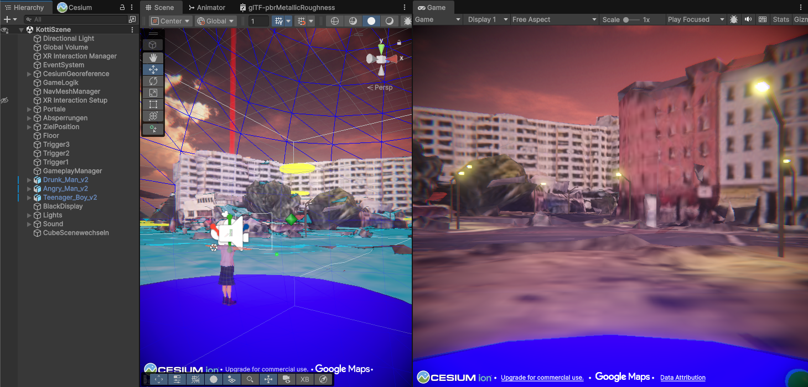

## 1. Introduction: The Journey of "GRENZEN"
Developing "GRENZEN" was a journey defined by intense technical exploration and constant problem-solving. As a student with only three months of C# experience and one minor collaborative Unity project in the past, taking on a full-scale VR production for the Meta Quest 2 was a massive leap.

The project was not just about coding; it was about mastering a complex pipeline of professional tools—from geospatial world-building to character generation and VR physics. For every creative decision made, hours of "Trial and Error" and deep-dives into developer forums followed. This documentation reflects a project that was built through persistence, learning-by-doing, and over 100+ hours of technical troubleshooting.

    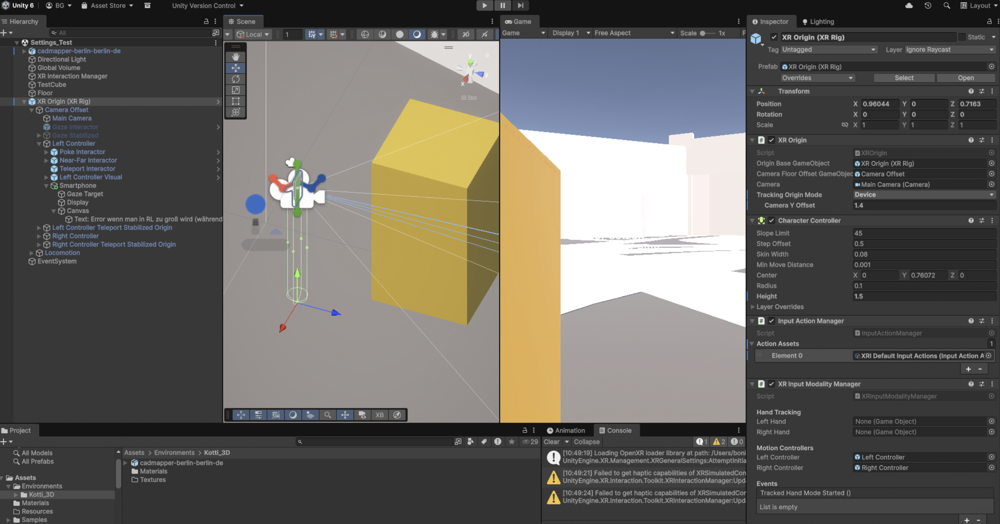
    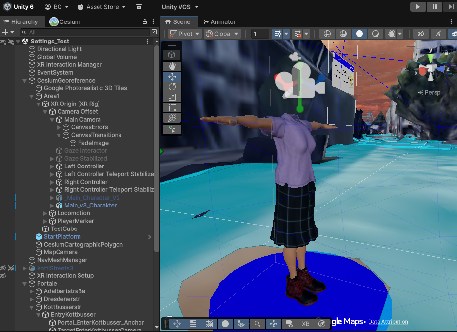

## 2. Technical Decisions & Reflection

### Decision: Detached Audio Architecture
**Problem:** Attaching AudioSources to animated NPC rigs caused the XR Interaction Toolkit to break the animation hierarchy.  
**Solution:** I developed a system where audio is spawned as a separate temporary object at the NPC's position. A `FollowTargetAudio` script ensures the voice stays with the character.  
**Reflection:** This was a major "failure case" that turned into a robust solution. It taught me that in VR development, you often have to work *around* the framework rather than *with* it.

### Decision: Perlin Noise for Mouth Movement
**Problem:** Traditional Lip-Sync (FFT) was unreliable and caused lag.  
**Solution:** I implemented "FakeMouthMovement" using Perlin Noise. It calculates a smooth, random value to drive the jaw rotation and blend shapes.  
**Reflection:** This approach is much more stable for a solo-developer project. It looks natural and never loses sync, even if the frame rate drops.

### Decision: Sequence over Triggers
**Problem:** Physical triggers (spheres) were inconsistent in VR, often firing multiple times or not at all.  
**Solution:** I replaced the triggers with a **CharacterSequencer**. It uses a "Relay" logic: NPC A finishes talking -> Signal to Sequencer -> NPC B starts following.  
**Reflection:** This made the game "bulletproof." No matter where the player goes, the story progresses in the correct order.

    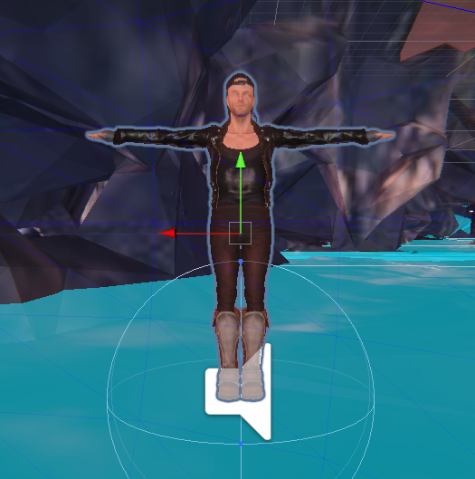
    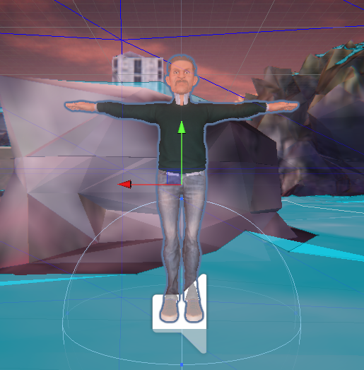
    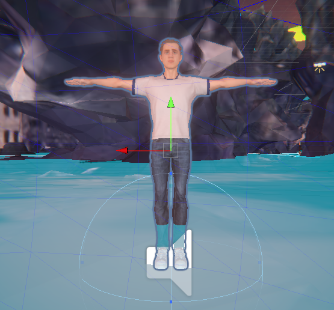

## 3. Challenge of my Comfort Zone

### Mastering the Pipeline (Cesium & CC4)
One of the biggest hurdles was the **Cesium for Unity** integration. Navigating 3D geospatial data felt like learning an entirely new program. Setting up the tilesets for Kottbusser Tor and ensuring the coordinate systems aligned with Unity’s world space consumed weeks of research.  
Additionally, I integrated **Character Creator 4** into my workflow. While it made character design more accessible, learning its professional interface and the complex export/import pipeline to Unity (including bone mapping and blend shapes) was a steep learning curve.

    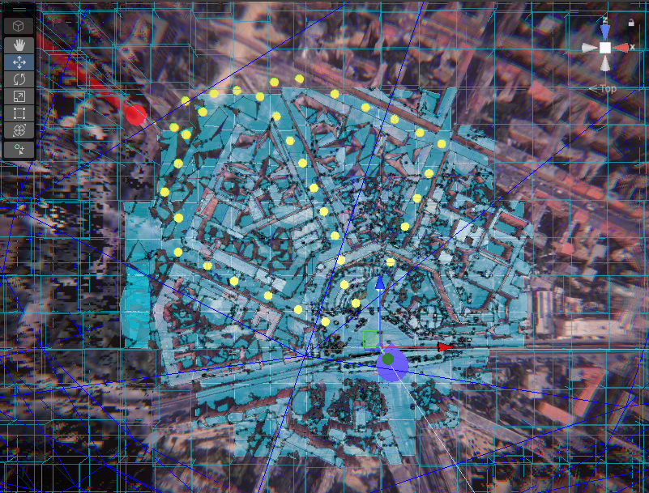

### The Physics of VR & Constant Debugging
Setting up the **XR Interaction Toolkit** and the physics was a daunting task. I spent the first third of the project fighting with "grey boxes" just to get basic VR settings and physics collisions to work.  
Actually, the project consisted almost entirely of debugging. I spent countless hours in forums, watching tutorials, and using **Gemini AI** as a pair-programmer to understand why systems weren't communicating.

    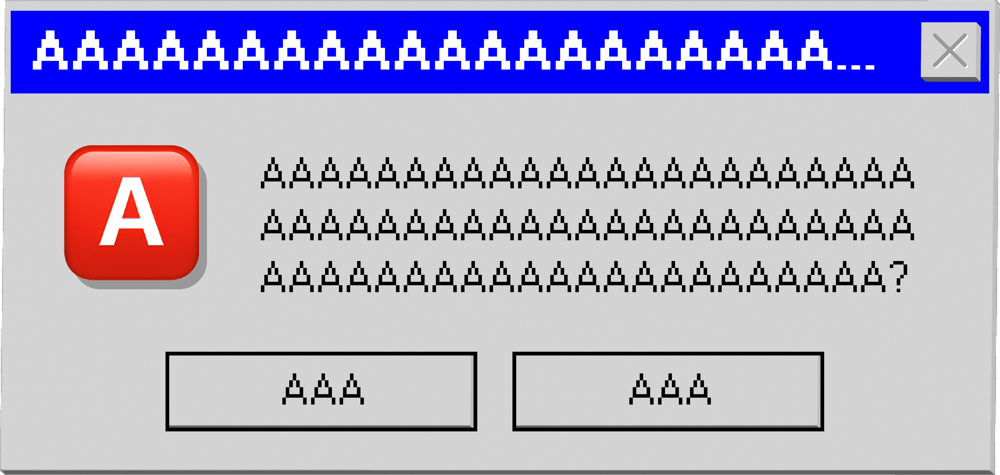

**The "Creative Oasis":** Whenever I could return to **Adobe Illustrator** for UI design or **Blender** for 3D modeling, I felt a huge sense of relief. These are areas where I feel confident, and using these skills to optimize assets was the most rewarding part of the journey.

## 4. MVP vs. Reality
The original plan included branching paths and glitch effects. Due to a 4-week pause for other university projects, I had to focus on the **Minimal Viable Product (MVP)**.  
**Achieved:** A stable, 3-scenario VR experience with a working minimap and a unique "embodied" feeling.  
**Not achieved:** Branching stories. However, the current linear flow is much more effective for delivering the intended message of "feeling trapped."

## 5. Work Diary & Timeline (Summary)
- **Month 1:** Focus on "The Foundation." Struggling with XR Settings, Cesium integration, and basic player movement. Lots of grey-boxing.
- **Month 2:** Project pause due to other deadlines.
- **Month 3 (Sprint):** Implementation of NPCs (CC4 & Mixamo). Pivoting from FFT to Perlin Noise. Final 16-hour "Bug-Marathon" to fix the NPC Sequencer and Audio Lifecycle.

    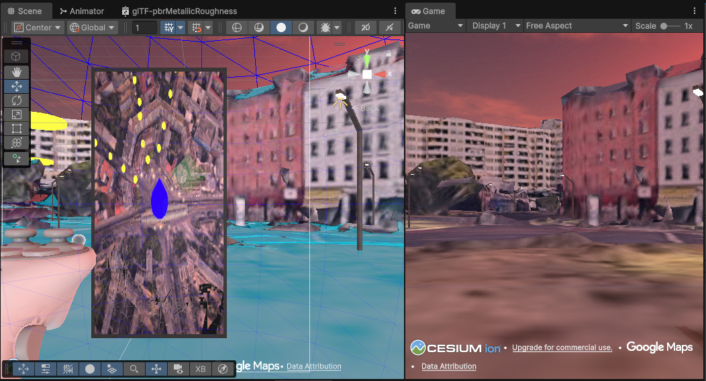
    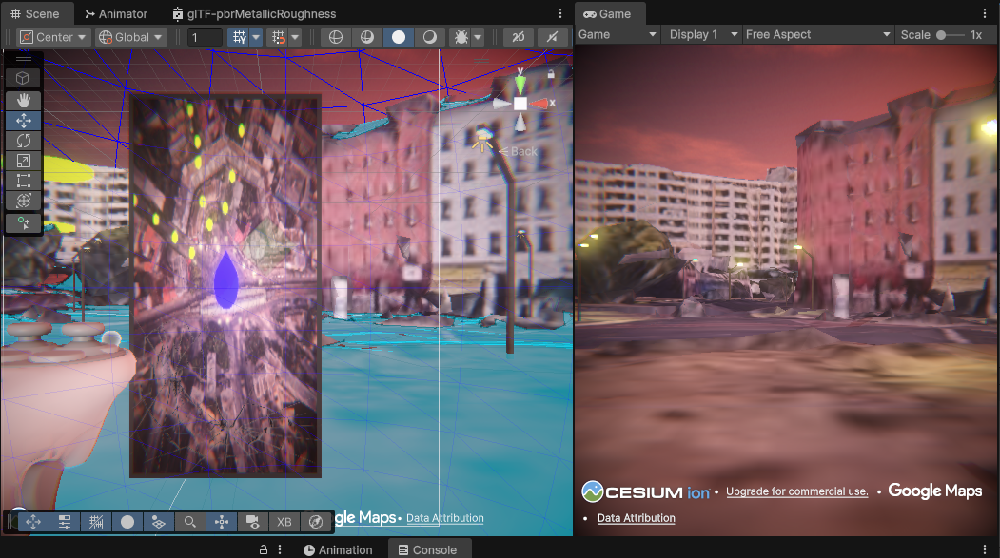

## 6. Conclusion
Most importantly: **I learned that the best solutions often emerge from failures.** The architecture I built through 100+ hours of debugging is more robust than what I originally planned. "GRENZEN" is a testament to the fact that technical hurdles can be overcome with research, AI assistance, and the will to keep going.

    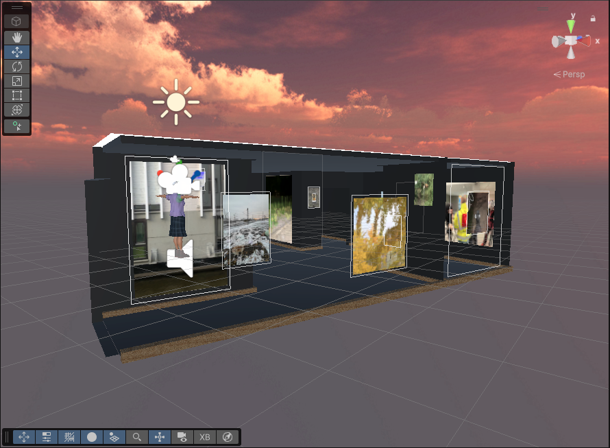

---
**Bonita Fiona von Gizycki** *Berlin, March 2026*