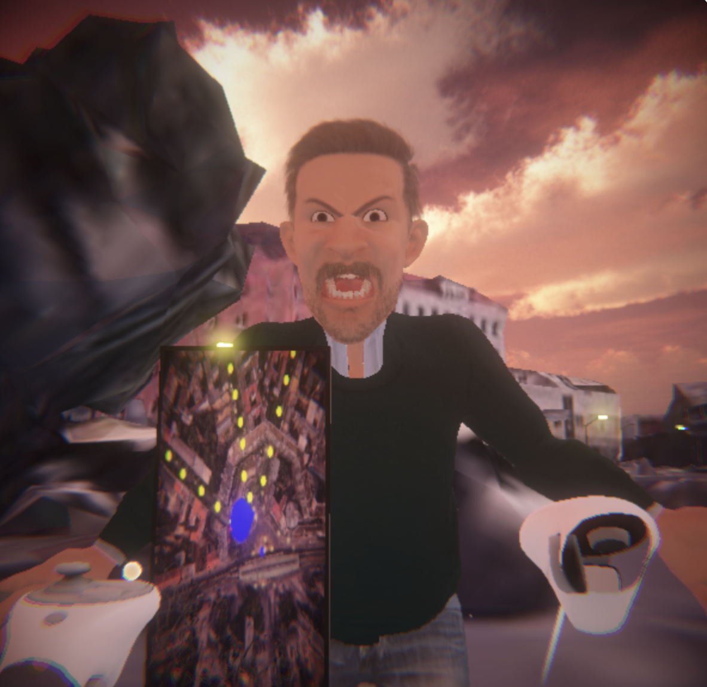
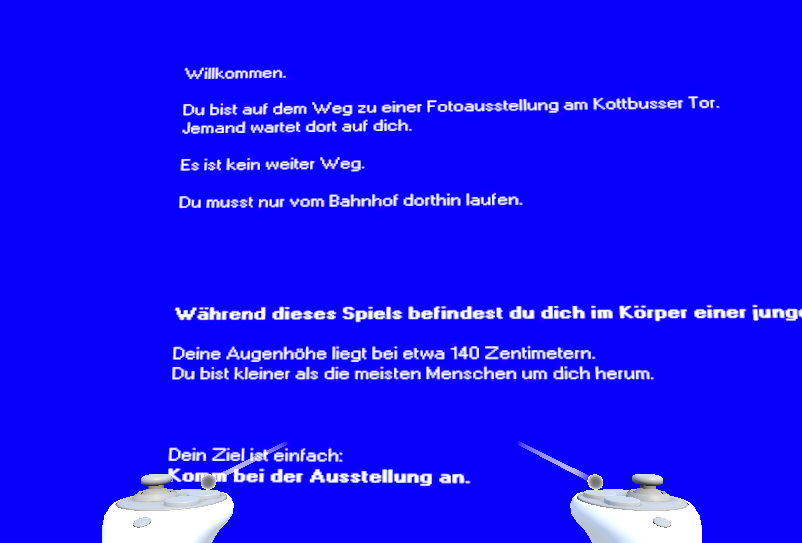
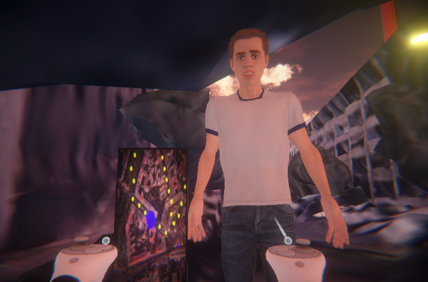
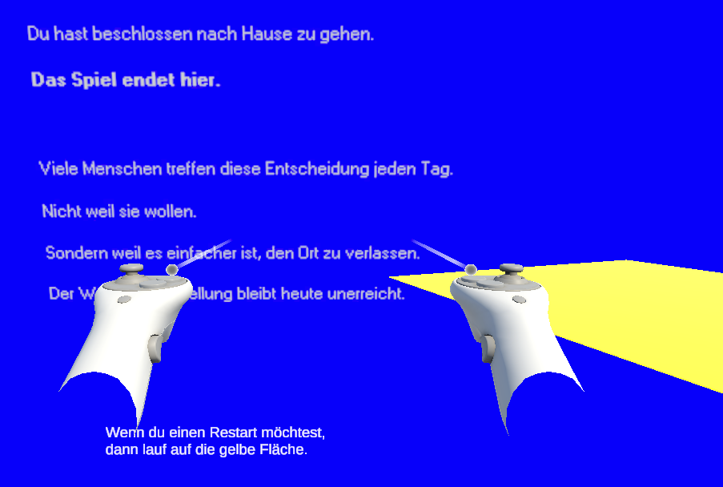

# GRENZEN (BOUNDARIES)
**VR Experience for Meta Quest 2 | Empathy Through Embodied Perspective-Taking**

---

> **Author:** Bonita Fiona von Gizycki  
> **Status:** Final University Project (MVP Complete)

---

- **Showoff - Let's Play:** [YOUTUBE](https://youtu.be/QbuluG_SNlY)
- **Playable Build (APK):** [LINK ZUR OWNCLOUD ZIP](https://owncloud.gwdg.de/index.php/s/VfRyY0rO5wQsKv2)
- **Instruction:** To install the APK on Meta Quest 2, please use SideQuest or ADB.
- **Source Code:** [LINK ZUM GITHUB](https://github.com/Boxnixta/grenzen-vr.git)
  - [Link zu den großen Assets](https://owncloud.gwdg.de/index.php/s/Z4s28vfMcbQ0h68)
---

## 🎯 Goal
"GRENZEN" is a VR experience that places the player in the body of a significantly smaller person. Walking through the authentic streets of Kottbusser Tor (Berlin), players experience street harassment and boundary violations. The goal is to build empathy for those who live this reality every day.

    
    
    

---

## 🎮 Gameplay
- **Authentic Environment:** Experience Kottbusser Tor, built with real 3D geospatial data (Cesium Ion).
- **Embodied Perspective:** A scaled XR-Origin makes the player feel physically smaller and more vulnerable.
- **Narrative NPCs:** Encounter characters who approach you, violate your personal space, and speak to you.
- **AI-Driven Animation:** NPCs feature AI-generated voices (ElevenLabs) and reactive mouth movements.

---

## 🛠️ Tech Stack & Implementation
- **Engine:** Unity 6 LTS (XR Interaction Toolkit)
- **Environment:** Cesium for Unity
- **Audio:** ElevenLabs AI & 3D Spatial Audio
- **Logic:** C# (Developed with assistance from Gemini AI for architecture & debugging)
- **Movement:** Continuous Locomotion (Analog Stick)

---

## 🎯 Core Technical Systems

### CharacterSequencer (Deterministic Flow)
Instead of unreliable physical triggers, I built a **CharacterSequencer**. It manages the story in a linear "relay race" style. When one NPC finishes talking, the next one is automatically activated. This ensures a predictable story flow even if physics collisions fail in VR.

### Audio Architecture (Detached Spawning)
I discovered that the XR Interaction Toolkit corrupted character animations when AudioSources were attached directly to the NPC rigs. 
**Solution:** When an NPC speaks, the system spawns a temporary "Audio-Object" that follows the NPC. This keeps the spatial 3D audio intact without breaking the animations.

### FakeMouthMovement (Perlin Noise)
Instead of complex FFT analysis (which often stutters), I used **Perlin Noise** to animate the jaw and blend shapes. This creates natural, organic-looking mouth movements that are independent of audio buffering issues.

---

## 🚀 Future Work
- **v1.1:** Add more NPC scenarios, haptic feedback, and visual color and "glitch" effects for stress moments.
- **v2.0:** Branching narratives based on player choices and professional human voice acting.

---

**Note on Development:** I'm new to Unity and Game Design. I am 3 months into learning C#. The code was developed through a collaborative process with Gemini AI and extensive research in developer forums to solve XR-specific bugs.